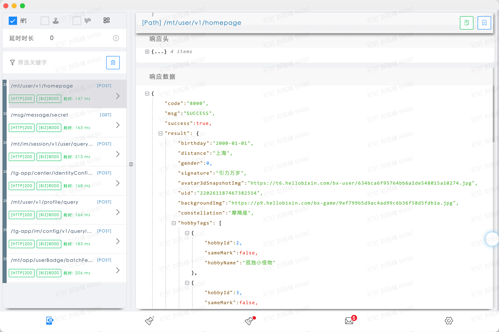
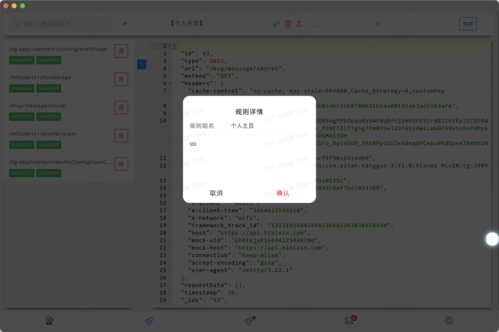
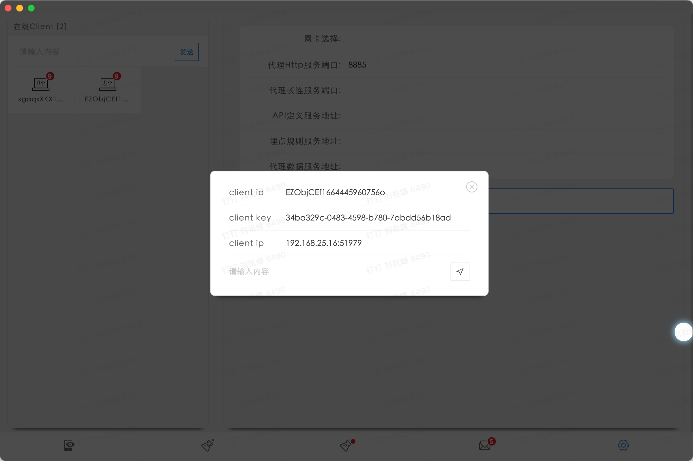

# app-api-proxy

> 旨在推动前后端研发分离的效率小工具，方便前端（移动/PC/FE）同学在研发过程透过代理方便地查看请求数据/伪造数据/覆盖边界，结合接口设计可在前后端并行开发中通过数据伪造功能实现对API接口实现依赖的解耦，加速研发流程。
> 原工程[app-mock-desktop](https://github.com/maskerliu/app-mock-desktop) 现在废弃了。
> 欢迎大家试用

> [预览](https://maskerliu-turbo-palm-tree-jrjxv9xq6gfqpgv-8884.preview.app.github.dev/#/settings)


> 这是一个集成了vue3+vant+pinia的electron项目模版工程，webpack5驱动构建，最终应用程序的生成使用了electron-builder。
> 使用了[electron-vue-boilerplates](https://github.com/maskerliu/electron-vue-boilerplates)，这是一个支持使用vue3来构建electron应用的脚手架，使用webpack5，参考了[electron-vue](https://github.com/SimulatedGREG/electron-vue)，升级了其老旧的脚本，并全部使用typescript来实现。









### Build Setup

``` bash
# install dependencies
pnpm import
pnpm install

# serve with hot reload at localhost:9080
pnpm run dev

# build electron application for production
pnpm run build

```

### 接入指南
> 您的应用需对网络请求框架做一个简单改造，在所有需要接入ApiProxy的请求URL的Host的替换为ApiProxy提供的Host，同时将需代理请求的Header中添加

``` java
req.headers['mock-host'] = origin_host;
req.headers['mock-uid'] = mock_uid;
```

> 即完成应用端改造，其中origin_host为原请求的host，mock-uid为AppMock代理请求client的id。